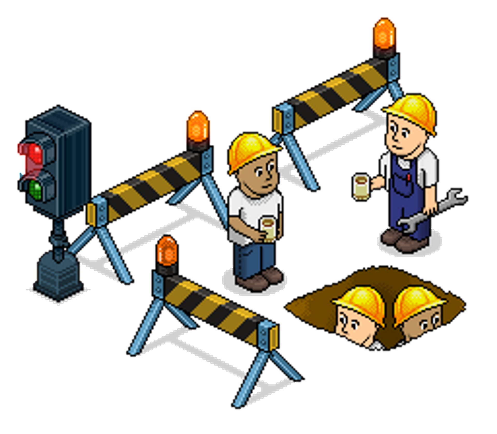
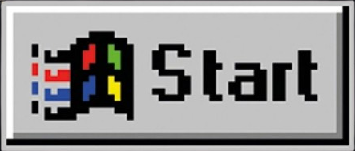

<!-- "Hero" Header -->

  
   
   
  
   
   

<table width="100%" align="center">
<tr>
<td align="center">
<a href="https://www.travelandleisure.com/thmb/UP6xwyXvyohheukdIFPWG6D3EpM=/1500x0/filters:no_upscale():max_bytes(150000):strip_icc()/snowfall-shirakawa-go-japan-MOSTSNOW0118-f91dd580962b4e2f9d7922f5aac2f84c.jpg">
<strong>The perfect place</strong>
 
 
 

</a>

</td>

<td align="center">
<a href="https://www.youtube.com/watch?v=E8gmARGvPlI">
<strong>Listen to it</strong>
 
 

 
</a>

</td>
</tr>
</table>

 

<!-- Footer -->

 

<!-- "margin-right: whatever;" -->
&nbsp;&nbsp;&nbsp;&nbsp;  

&nbsp;&nbsp;&nbsp;&nbsp;  

